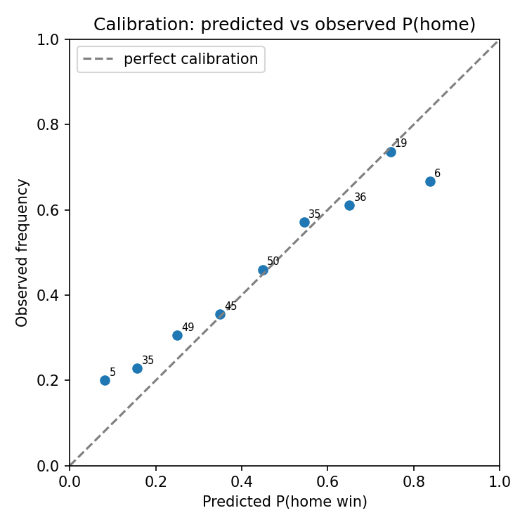

# matchsim evaluation report

Generated by `matchsim eval --season 2025-26`. Train: 750 real Serie A
matches before 2025-08-23. Holdout: 344 real
matches from the 2025-26 season (data/results.csv, not demo data).

## Tier 1 (Dixon-Coles)

- RPS: **0.2169** (literature benchmark: ~0.20-0.21 state of the art on open data; >0.23 is considered broken)
- Brier: 0.5868
- Log-likelihood: -276.86 vs naive baseline -301.06 (baseline = league-average home/draw/away rates: 0.411/0.293/0.296)

## Ensemble (Dixon-Coles + pi-ratings, unweighted average)

- RPS: 0.2165
- Brier: 0.5852
- n evaluable holdout matches: 280 (pi-ratings needs both teams seen during training; Tier 1 alone covers 280)

## Calibration (Tier 1, P(home win))

| Bin | n | Mean predicted | Observed frequency |
| --- | --- | --- | --- |
| 0.0-0.1 | 5 | 0.082 | 0.200 |
| 0.1-0.2 | 35 | 0.157 | 0.229 |
| 0.2-0.3 | 49 | 0.249 | 0.306 |
| 0.3-0.4 | 45 | 0.350 | 0.356 |
| 0.4-0.5 | 50 | 0.448 | 0.460 |
| 0.5-0.6 | 35 | 0.545 | 0.571 |
| 0.6-0.7 | 36 | 0.650 | 0.611 |
| 0.7-0.8 | 19 | 0.746 | 0.737 |
| 0.8-0.9 | 6 | 0.838 | 0.667 |

## Ablation table

| Model | Dataset | Held-out RPS |
| --- | --- | --- |
| Tier 1 alone (Dixon-Coles) | real Serie A results.csv, 2025-26 | 0.2169 |
| Tier 2 without matchup terms | StatsBomb Serie A 2015/16 demo, 30-game holdout | 0.2074 |
| Tier 2 with matchup terms | StatsBomb Serie A 2015/16 demo, 30-game holdout | 0.1942 |
| Ensemble (Dixon-Coles + pi-ratings) | real Serie A results.csv, 2025-26 | 0.2165 |

Style-interaction term (spec 4.4): one example split gave held-out RPS 0.1942 with vs 0.2074 without (in-sample p=0.0048). Mean RPS delta over 6 splits: -0.0099. -> **dropped**, not wired into the shipped link. Note: a single 80/20 split isn't decisive at this demo's scale (the mean delta above is favourable), but adding the term makes `beta_strength` flip sign -- attack_diff and the interaction term correlate (~0.3) at very different scales, and a flipped core coefficient would make the coach-facing explanation actively wrong. That instability, not the RPS number alone, is why it's dropped.

Tier 1/ensemble and the two Tier 2 rows are evaluated on different datasets:
no 2026-27 lineup or event data exists to evaluate Tier 2 on the real
results.csv holdout (CLAUDE.md section 1), so Tier 2 is evaluated on its own
StatsBomb open-data demo holdout instead. The RPS numbers are not directly
comparable across that boundary; each row states its own dataset.
